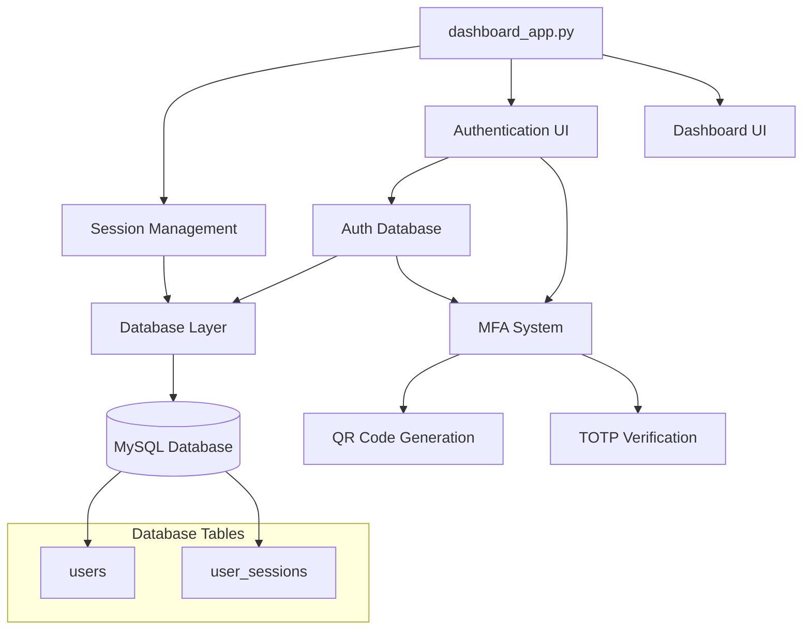
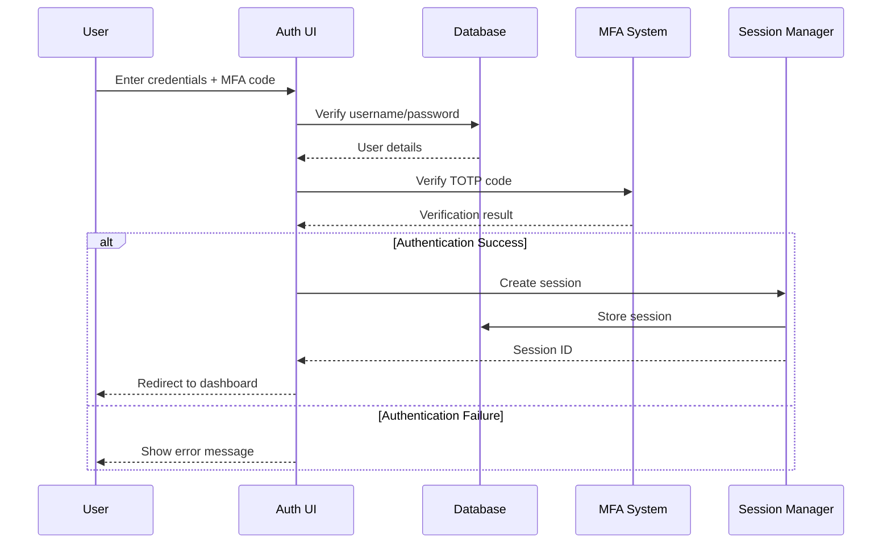
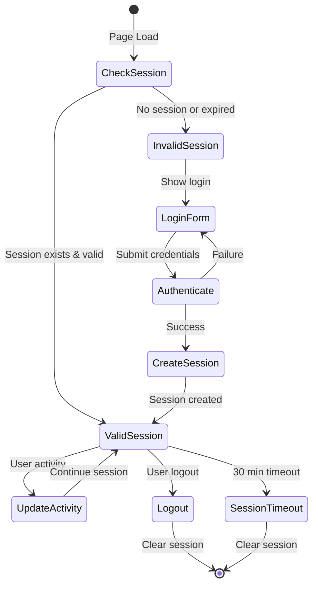

# Streamlit Authentication System 🔐

A comprehensive, production-ready authentication system for Streamlit applications with Multi-Factor Authentication (MFA), role-based access control, and session management.

## ✨ Features

- **🔒 Secure Authentication**: Password hashing with bcrypt
- **📱 Multi-Factor Authentication (MFA)**: TOTP-based 2FA with QR code generation
- **👥 Role-Based Access Control**: Admin and user roles with different permissions
- **⏰ Session Management**: Secure session handling with configurable timeouts
- **🔄 Password Reset**: Self-service password reset with MFA verification
- **🗄️ Database Integration**: MySQL database with proper connection pooling
- **🎨 Modular Design**: Easy to integrate with existing Streamlit applications
- **📊 Admin Panel**: User registration and management capabilities

## 🚀 Quick Start

### Prerequisites

- Python 3.8+
- MySQL Database
- Required Python packages (see requirements below)

### Installation

1. **Clone the repository**
   ```bash
   git clone https://github.com/yourusername/streamlit-auth-system.git
   cd streamlit-auth-system
   ```

2. **Install dependencies**
   ```bash
   pip install streamlit pymysql bcrypt pyotp qrcode python-dotenv
   ```

3. **Set up environment variables**
   Create a `.env` file in the root directory:
   ```env
   DB_HOST=your_mysql_host
   DB_USER=your_mysql_user
   DB_PASSWORD=your_mysql_password
   DB_DATABASE=your_database_name
   ```

4. **Initialize the database**
   The system will automatically create the required tables on first run.

5. **Run the application**
   ```bash
   streamlit run dashboard_app.py
   ```

## 📋 Requirements

```txt
streamlit>=1.28.0
pymysql>=1.1.0
bcrypt>=4.0.0
pyotp>=2.9.0
qrcode>=7.4.0
python-dotenv>=1.0.0
Pillow>=10.0.0
```

## 🏗️ System Architecture

### Component Overview



### Authentication Flow



### Session Management Flow



## 📁 Project Structure

```
streamlit-auth-system/
├── dashboard_app.py          # Main application entry point
├── db/
│   ├── __init__.py
│   ├── auth_db.py           # Authentication database operations
│   └── setup_db.py          # Database initialization
├── ui/
│   ├── __init__.py
│   ├── auth_ui.py           # Authentication UI components
│   └── dashboard_ui.py      # Your custom dashboard (implement this)
├── db_backups/
│   └── auth_db_setup.sql    # Database schema backup
├── .env                     # Environment variables (create this)
├── requirements.txt         # Python dependencies
└── README.md               # This documentation
```

## 🔧 Configuration

### Environment Variables

| Variable | Description | Required |
|----------|-------------|----------|
| `DB_HOST` | MySQL database host | Yes |
| `DB_USER` | MySQL database username | Yes |
| `DB_PASSWORD` | MySQL database password | Yes |
| `DB_DATABASE` | MySQL database name | Yes |

### Session Configuration

```python
# In dashboard_app.py
SESSION_TIMEOUT = 1800  # 30 minutes in seconds
```

## 🎯 Integration Guide

### Adding Your Custom Dashboard

1. **Create your dashboard module**
   ```python
   # ui/dashboard_ui.py
   import streamlit as st
   
   def show_dashboard():
       st.title("Your Custom Dashboard")
       
       # Get current user info
       username = st.session_state.get('username')
       role = st.session_state.get('role')
       
       st.write(f"Welcome, {username}!")
       st.write(f"Your role: {role}")
       
       # Add your dashboard content here
       if role == 'admin':
           st.subheader("Admin Features")
           # Admin-specific content
       else:
           st.subheader("User Features")
           # User-specific content
   ```

2. **The system automatically imports and uses your dashboard**
   - No changes needed to `dashboard_app.py`
   - Your `show_dashboard()` function will be called automatically

### Role-Based Access Control

```python
# In your dashboard
def show_dashboard():
    role = st.session_state.get('role')
    
    if role == 'admin':
        # Admin-only features
        st.sidebar.button("Admin Panel")
        show_admin_features()
    elif role == 'user':
        # User features
        show_user_features()
    else:
        st.error("Unauthorized access")
```

## 🔐 Security Features

### Password Security
- **Bcrypt hashing**: Industry-standard password hashing
- **Salt generation**: Unique salt for each password
- **Configurable rounds**: Adjustable computational cost

### Multi-Factor Authentication
- **TOTP-based**: Time-based One-Time Passwords
- **QR code generation**: Easy setup with authenticator apps
- **Grace window**: 30-second validation window for clock drift

### Session Security
- **Secure tokens**: Cryptographically secure session IDs
- **Timeout management**: Automatic session expiration
- **Server-side storage**: Sessions stored in database, not client-side

### Database Security
- **Prepared statements**: Protection against SQL injection
- **Connection pooling**: Efficient database connection management
- **Error handling**: Comprehensive error logging without exposing sensitive data

## 📊 Database Schema

### Users Table
```sql
CREATE TABLE users (
    id INT AUTO_INCREMENT PRIMARY KEY,
    username VARCHAR(255) NOT NULL UNIQUE,
    password_hash VARCHAR(255) NOT NULL,
    mfa_secret VARCHAR(255),
    role ENUM('admin', 'user') NOT NULL DEFAULT 'user',
    created_at DATETIME DEFAULT CURRENT_TIMESTAMP
);
```

### User Sessions Table
```sql
CREATE TABLE user_sessions (
    session_id VARCHAR(255) PRIMARY KEY,
    username VARCHAR(255) NOT NULL,
    role VARCHAR(50) NOT NULL,
    created_at BIGINT NOT NULL,
    INDEX (username)
);
```

## 🎮 Usage Examples

### Basic Dashboard Integration
```python
# ui/dashboard_ui.py
import streamlit as st
import pandas as pd

def show_dashboard():
    st.title("My Custom Dashboard")
    
    # Access user session data
    username = st.session_state.username
    role = st.session_state.role
    
    # Create role-based content
    if role == 'admin':
        show_admin_dashboard()
    else:
        show_user_dashboard()

def show_admin_dashboard():
    st.subheader("📊 Admin Dashboard")
    
    col1, col2, col3 = st.columns(3)
    with col1:
        st.metric("Total Users", "42")
    with col2:
        st.metric("Active Sessions", "12")
    with col3:
        st.metric("System Status", "Online")
    
    # Add charts, tables, etc.
    data = pd.DataFrame({
        'Date': pd.date_range('2024-01-01', periods=30),
        'Users': np.random.randint(10, 50, 30)
    })
    st.line_chart(data.set_index('Date'))

def show_user_dashboard():
    st.subheader("👤 User Dashboard")
    st.write("Welcome to your personal dashboard!")
    # Add user-specific content
```

### Advanced Authentication Hooks
```python
# Custom authentication checks
def require_admin():
    if st.session_state.get('role') != 'admin':
        st.error("Admin access required")
        st.stop()

def require_authentication():
    if not st.session_state.get('authenticated'):
        st.error("Please log in to access this page")
        st.stop()

# Use in your dashboard
def show_admin_panel():
    require_admin()
    st.title("Admin Panel")
    # Admin content here
```

## 🐛 Troubleshooting

### Common Issues

1. **Database Connection Errors**
   - Verify MySQL server is running
   - Check environment variables in `.env`
   - Ensure database exists and user has proper permissions

2. **MFA Setup Issues**
   - Ensure authenticator app supports TOTP
   - Check system time synchronization
   - Verify QR code is readable

3. **Session Management Issues**
   - Clear browser cache and cookies
   - Check session timeout configuration
   - Verify database connectivity

### Debug Mode
Enable debug logging:
```python
import logging
logging.basicConfig(level=logging.DEBUG)
```

## 🤝 Contributing

We welcome contributions! Here's how you can help:

1. **Fork the repository**
2. **Create a feature branch**: `git checkout -b feature/amazing-feature`
3. **Commit your changes**: `git commit -m 'Add amazing feature'`
4. **Push to the branch**: `git push origin feature/amazing-feature`
5. **Open a Pull Request**

## 📄 License

This project is licensed under the MIT License - see the [LICENSE](LICENSE) file for details.

## 🙏 Acknowledgments

- **Streamlit** - Amazing framework for data applications
- **PyOTP** - TOTP implementation
- **bcrypt** - Secure password hashing
- **QRCode** - QR code generation

## 📞 Support

If you encounter any issues or have questions:

1. Check the [Issues](https://github.com/yourusername/streamlit-auth-system/issues) page
2. Create a new issue with detailed information
3. Join our community discussions

---

**Made with ❤️ for the Streamlit community**

*Happy coding! 🚀*
